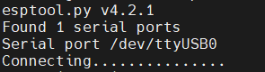
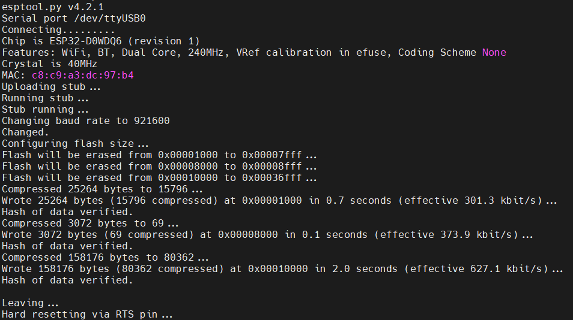
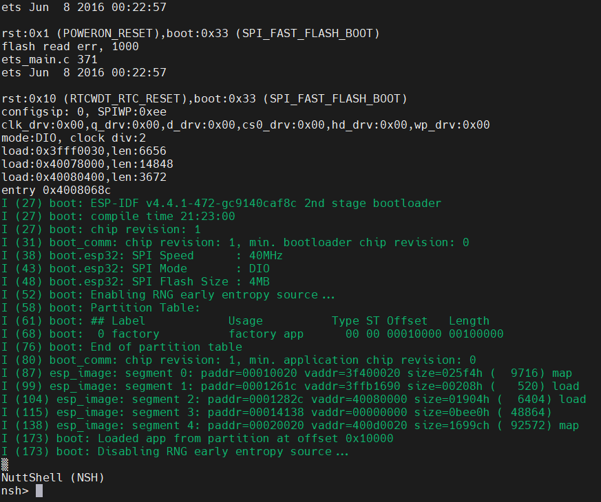

# Laborator 1. Configurare si instalare NuttX pe ESP32

In acest laborator veti invata cum sa compilati si sa incarcati sistemul de operare NuttX pe placutele ESP32 Sparrow. Acestea (ESP32 Sparrow) sunt construite pornind de la un modul de ESP32 Wrover la care au fost adaugate:

- un senzor de lumina - LTR308
- un senzor de temperatura, umiditate si presiune - BME680
- un display OLED cu rezolutia 128x32 - SSD1306
- un microfon prin I2S
- un cititor de carduri microSD

<p align="center">
  
</p>

## Setup de development

### Linux

Daca rulati pe un sistem cu Linux nativ, continuati de la pasul [Compilarea si incarcarea pe placuta].

### Windows

Pentru a putea rula pe Windows, va trebui sa va configurati o masina virtuala de Linux prin care sa aveti acces la porturile USB ale host-ului - astfel conectarea la placuta se va face direct prin USB de pe masina virtuala. Pentru instalarea Linuxului puteti folosi [masina virtuala](https://repository.grid.pub.ro/cs/so/linux-2021/so-ubuntu-20-04.ova) de la SO din anul 3 - este suficient sa aveti un sistem Linux minimal, doar din linie de comanda. Alternativ, puteti instala orice alta distributie de Linux (Ubuntu, Linux Mint, etc.).

Pentru a instala masina virtuala, este recomandat sa folositi [VMware Workstation 16 pro](https://vmware.pub.ro/), deoarece este foarte usor de configurat.

Daca nu aveti acces la VMware (nu aveti licenta), puteti sa folositi si [VirtualBox](https://www.virtualbox.org/), dar cu niste pasi in plus pentru a-l configura.

In mod normal, o masina virtuala prin VirtualBox nu este accesibila direct de pe host. Totusi, pentru a va putea conecta la masina virtuala prin SSH (folosind [MobaXterm](https://mobaxterm.mobatek.net/), de exemplu), puteti urmari pasii de mai jos:

- intrati in setarile masinii virtuale si adaugati a 2a interfata de retea. Prima va fi o interfata host-only pentru a permite conectivitatea de la host la guest (ssh), iar a 2a interfata va fi sub un NAT pentru a putea avea acces la internet.
- porniti masina virtuala. Testati cu `ping 8.8.8.8` ca sunteti conectat la Internet.
- adaugati o adresa IP statica pe a 2a interfata folosind subreteaua `192.168.56.0/24`. De exemplu, puteti folosi `192.168.56.56/24`. Alternativ, puteti configura un client de DHCP.

Pentru a putea avea acces la portul USB direct din masina virtuala, din bara de sus a masinii virtuale selectati `Devices` > `USB devices` > `controller-ul UART`.

Momentan WSL-ul nu are suport nativ pentru interactiunea cu diferite device-uri peste USB. Daca doriti sa folositi totusi WSL, puteti folosi acest [tool](https://learn.microsoft.com/en-us/windows/wsl/connect-usb) open source.

### MacOS

Pentru a rula pe MacOS puteti urmari tutorialul de [aici](https://github.com/robertalexa2000/nuttx-esp32-docs/blob/si_labs/bringup/macos_tutorial.md).

## Compilarea si incarcarea pe placuta

Pasii de mai jos trebuie urmati ca utilizator privilegiat (root):

- instalarea pachetelor (dependintelor) pe Linux
- descarcarea unui compilator (toolchain), deoarece arhitectura target este Xtensa, deci nu putem compila cu gcc-ul default de pe distributiile de Linux x86
- descarcarea repository-urilor de NuttX: nuttx, apps
- descarcarea tabelei de partitii si a bootloader-ului. Acestea sunt precompilate pentru fiecare release (versiune) de NuttX, insa pot fi compilate si din linie de comanda.
- compilarea in urma careia va rezulta un binar
- incarcarea binarului pe placuta

Daca doriti sa continuati ca utilizator neprivilegiat, puteti consulta tutorialul de [aici](https://blog.espressif.com/getting-started-with-esp32-and-nuttx-fd3e1a3d182c).

### Instalarea pachetelor lipsa

```
apt-get update
apt-get upgrade -y
apt-get install -y bison flex gettext texinfo libncurses5-dev libncursesw5-dev gperf automake libtool pkg-config build-essential gperf genromfs libgmp-dev libmpc-dev libmpfr-dev libisl-dev binutils-dev libelf-dev libexpat-dev gcc-multilib g++-multilib picocom u-boot-tools util-linux chrony libusb-dev libusb-1.0.0-dev kconfig-frontends python3-pip
```

### Descarcarea toolchain-ului

```
wget https://github.com/espressif/crosstool-NG/releases/download/esp-12.2.0_20230208/xtensa-esp32-elf-12.2.0_20230208-x86_64-linux-gnu.tar.xz
tar -xf xtensa-esp32-elf-12.2.0_20230208-x86_64-linux-gnu.tar.xz
mkdir /opt/xtensa
mv xtensa-esp32-elf/ /opt/xtensa/
echo "export PATH=\$PATH:/opt/xtensa/xtensa-esp32-elf/bin" >> ~/.bashrc
source ~/.bashrc
```

### Descarcarea repository-urilor

```
mkdir ~/nuttxspace && cd ~/nuttxspace
git clone https://github.com/apache/incubator-nuttx.git nuttx
git clone https://github.com/apache/incubator-nuttx-apps.git apps
```

**De notat**: NuttX foloseste 2 directoare separate:

- nuttx, care contine sistemul de operare: scheduler, drivere, sisteme de fisiere, etc.
- apps, care contine aplicatiile.

Una din etapele compilarii presupune ca sistemul de build sa creeze o biblioteca statica denumita `libapps.a` care va fi adaugata la binarul de NuttX in etapa de linking.

### Descarcarea tabelei de partitii si a bootloader-ului

```
mkdir esp-bins
curl -L "https://github.com/espressif/esp-nuttx-bootloader/releases/download/latest/bootloader-esp32.bin" -o esp-bins/bootloader-esp32.bin
curl -L "https://github.com/espressif/esp-nuttx-bootloader/releases/download/latest/partition-table-esp32.bin" -o esp-bins/partition-table-esp32.bin
```

### Compilarea si rularea

```
pip3 install esptool
pip3 install pyserial
cd ~/nuttxspace/nuttx
./tools/configure.sh -l esp32-sparrow-kit:nsh
make -j4
esptool.py erase_flash
make flash ESPTOOL_PORT=/dev/ttyUSB0 ESPTOOL_BAUD=115200 ESPTOOL_BINDIR=../esp-bins
```

In functie de tipul de placuta pe care rulati, este posibil sa fie nevoie sa apasati butonul de `BOOT` (`IO0`) atunci cand incarcati NuttX. Astfel, placuta intra in modul de "Download" - in mod normal, placuta este in starea de "Boot". Butonul trebuie apasat doar atunci cand se incearca stabilirea conexiunii cu firmware-ul de pe ESP32, asa cum se poate vedea mai jos:

<p align="center">
  
</p>

Pentru a va conecta la placuta veti folosi `picocom /dev/ttyUSB0 -b 115200`.

In cazul in care sistemul de build nu detecteaza in mod automat calea catre repo-ul de apps, aceasta poate fi specificata prin `-a ../apps`. Pentru toti parametri disponibili puteti folosi `./tools/configure.sh -h`. Alternativ, calea catre directorul de apps poate fi configurata prin CONFIG_APPSDIR.

Daca compilati pentru un alt tip de placuta ESP32 - pentru un modul WROOM, de exemplu - trebuie sa folositi `./tools/configure.sh esp32-devkitc:nsh`. De asemenea, deoarece placutele Sparrow sunt construite peste modulul WROVER, puteti sa folositi si `./tools/configure.sh esp32-wrover-kit:nsh`. Insa in acest caz va trebui sa configurati manual NuttX-ul prin `make menuconfig` astfel incat sa puteti folosi componentele hardware adaugate pe Sparrow.

Incarcarea binarului pe placuta se poate face si prin `esptool.py --chip esp32 --port /dev/ttyUSB0 --baud 921600 write_flash 0x1000 ../esp-bins/bootloader-esp32.bin 0x8000 ../esp-bins/partition-table-esp32.bin 0x10000 nuttx.bin`.

Daca nu aveti erori, ar trebui sa va apara un log asemanator cu cel de mai jos:

<p align="center">
  
</p>

In final, ar trebui sa obtineti si un log de boot asemanator cu cel din screenshot-ul atasat:

<p align="center">
  
</p>

## Exercitii

1. Folosind sistemul de build al NuttX, activati compilarea aplicatiei "Hello, World!". Codul sursa il puteti gasi in `apps/examples/hello`. Odata incarcat pe placuta, rulati aplicatia din linie de comanda.

**Hint**:
- pentru a putea compila "Hello, World!" trebuie sa activati config-ul CONFIG_EXAMPLES_HELLO folosind `make menuconfig`. Cautarea unui anume config se poate face la fel ca in VIM, folosind `/` urmat de string-ul dorit.
- odata compilat si incarcat NuttX, utilizati comanda `?` pentru a vedea cum se poate rula aplicatia.

2. Asemanator exercitiului anterior, compilati si incarcati aplicatia "rgbled".

**De notat**: daca rulati pe placutele verzi, trebuie sa schimbati pinii LED-ului:
- CONFIG_ESP32_LEDC_CHANNEL0_PIN=25
- CONFIG_ESP32_LEDC_CHANNEL1_PIN=26
- CONFIG_ESP32_LEDC_CHANNEL2_PIN=27

3. **Bonus** - faceti led-ul sa clipeasca o data pe secunda in rosu, verde, albastru.
