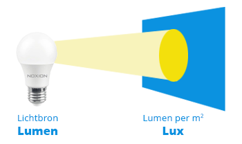
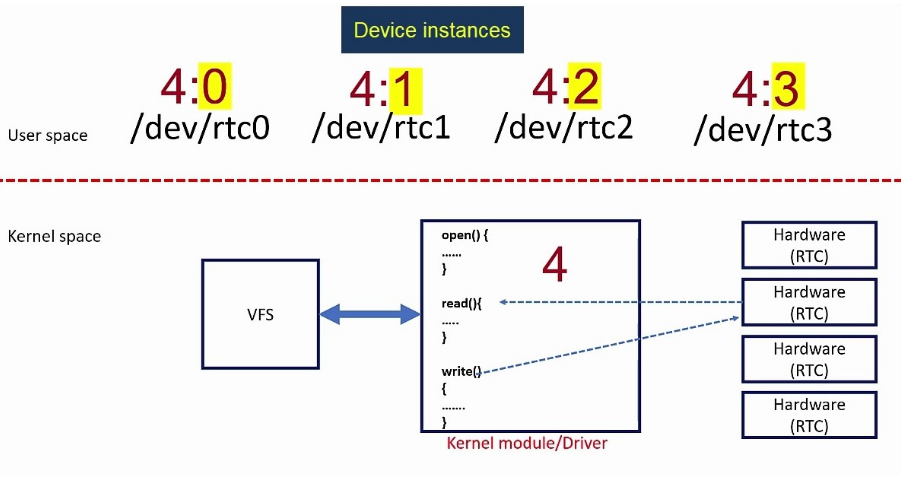
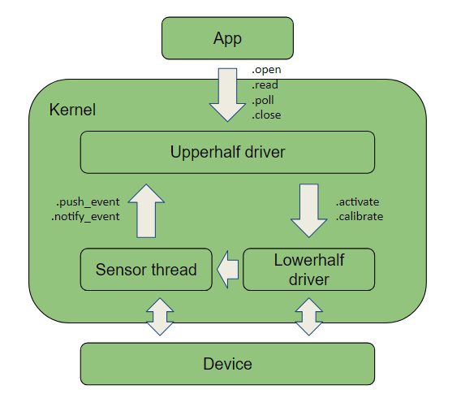
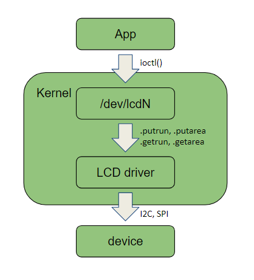
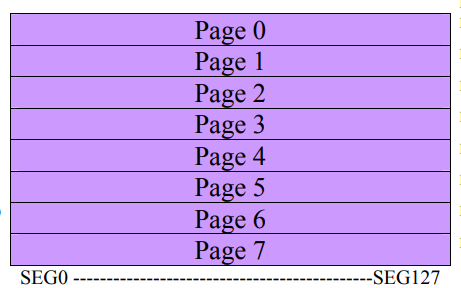
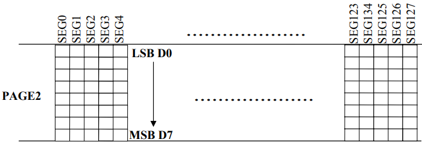
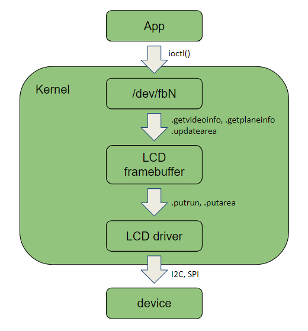

# Laborator 2. Senzori si display-uri in NuttX.

In laboratorul de astazi veti invata 

## LTR308 - senzor de lumina

### Cum masuram lumina?

Atunci cand vorbim de unitati de masura pentru lumina, ne referim la lumeni vs luxi:
- lumeni reprezinta intensitatea luminoasa la sursa
- luxi reprezinta intensitatea luminoasa care cade pe un metru patrat, in general masurata de la 1 sau 10m distanta

  

Astfel, pentru a putea masura complet o sursa de lumina, avem nevoie de ambele unitati e masura. De exemplu, o lanterna poate avea un output foarte mare de lumeni, dar daca razele sunt dispersate pe o suprafata intinsa va rezulta intr-o cantitate mica de luxi.

Cu alte cuvinte, intensitatea luminoasa "reala" se masoara mai degraba prin luxi.

### LTR308

LTR308 este un senzor de lumina care comunica prin I2C si este capabil sa ofere utilizatorului intensitatea luminoasa exprimata in luxi. In NuttX, senzorii sunt expusi prin char device-uri in `/dev/` si pot fi accesati prin syscall-uri, asemanator implementarii Linux.

Figura de mai jos ilustreaza implementarea char device-urilor in Linux - astfel, fiecare periferic este liber sa isi defineasca propriile metode de open, read, write, ioctl, close.

  

Pe de alta parte, deoarece NuttX este un RTOS care isi propune sa aiba un memory-footprint cat mai scazut, design-ul pentru char device-urile (ale senzorilor, dar constrangerea se respecta intr-o mare masura si la alte periferice) este putin schimbat.

  

La nivelul sistemului de operare exista o interfata uniformizata denumita `upperhalf driver` (`nuttx/drivers/sensors/sensor.c`), comuna tutoror senzorilor, care intercepteaza apelurile de sistem asociate acestora. Mai departe, comenzile sunt trimise catre `lowerhalf driver`(`nuttx/drivers/sensors/ltr308.c`) care este specific device-ului si se ocupa de interactiunea prin I2C/SPI cu senzorul.

O alta particularitate a NuttX este ca pentru a citi datele unui senzor nu se parcurge intregul lant de comanda de la aplicatie pana in registri senzorului. In schimb, driver-ul creeaza un thread separat care se ocupa de polling, iar atunci cand detecteaza ca au venit date le trimite printr-o notificare in upperhalf driver intr-un buffer circular. Mai departe, datele ajung la aplicatie.

## SSD1306 - display OLED

### OLED vs LCD

Un aspect interesant cand vine vorba despre display-uri este cum produc ele culoarea. Daca in cazul unui LCD avem pixeli colorati care sunt luminati pentru a produce culorile, in cazul unui OLED avem control asupra fiecarui pixel in parte.

De exemplu, pentru a produce culoarea negru un LCD va colora pixelii in negru si ii va lumina folosind un backlight. In schimb, deoarece un display de tip OLED permite control granular asupra pixelilor, este suficient sa nu mai luminam anumiti pixeli iar astfel zona aceea de ecran va aparea neagra catre utilizator.

Astfel, se spune ca un display OLED poate sa obtina "true darkness".

Desi la nivel tehnic exista distinctia intre cele doua tipuri de display-uri, in NuttX ambele sunt organizate sub denumirea de LCD-uri. Este responsabilitatea fiecarui driver sa interfateze corect interactiunea cu device-ul sau asociat.

### LCD driver in NuttX

Pornind de la design-ul driver-ului de senzori, putem regasi aceleasi principii si in cazul LCD-urilor.

Cea mai simpla metoda de a interactiona cu un display este prin apeluri de `ioctl()` pe un LCD char device. Acestea vor fi trimise mai departe catre driver-ul specific display-ului care este responsabil de configurarea lui si de afisarea mesajelor. 

In cazul lui SSD1306, acesta poate fi accesat atat prin I2C, cat si prin SPI. Pe placutele ESP32-Sparrow comunicatia se realizeaza prin I2C.

  

Daca ar fi sa ne uitam in interiorul unui display, acesta este doar o matrice de pixeli organizata pe linii si coloane.

  

In cazul unui display cu rezolutie 128x32 precum cel de pe placile Sparrow, exista:
- 128 de coloane adresabile individual
- 32 de randuri adresabile la nivel de pagina, unde o pagina contine 8 randuri.

Astfel, putem sa scriem o coloana individuala dar pentru a scrie un rand este nevoie sa scriem intreaga pagina asociata randului.

  

Char device-ul pentru LCD-uri este cea mai simpla metoda de a interactiona cu un display din punct de vedere al consumului de memorie - nu se face niciun fel de buffering al datelor. De exemplu, pentru a desena doua linii:

- se deseneaza prima linie
- deoarece nu se face buffering la date, daca am desena a doua linie am sterge din greseala prima linie. Solutia este sa recitim registri display-ului.
- acum suntem obligati sa redesenam prima linie impreuna cu a doua.

Urmatorul nivel de complexitate este reprezentat de framebuffer. Acesta introduce un API propriu, dar care in final apeleaza tot callback-uri din driver-ul device-ului. Poate cea mai importanta modificare fata de un simplu char device este chiar in numele lui - ofera support de buffering.

  

**De notat**: framebuffer-ul poate fi implementat atat prin buffer software, cat si prin buffer hardware (direct in memoria display-ului). In NuttX, framebuffer-ul este intotdeauna software.

Ultimul nivel de complexitate este reprezentat de subsistemul de graphics.

  

Aplicatiile interactioneaza in mod direct atat cu biblioteca `nuttx/libs/libnx/`, cat si cu `nuttx/graphics/`. Componenta principala este `nxglib` si este responsabila de interactiunea in mod direct cu LCD-ul folosindu-se de interfata de framebuffer explicata anterior.

O alta componenta foarte importanta este `nxmu` (mu - multi-user). Astfel, se foloseste un mecanism de tipul client-server, in care server-ul ruleaza pe un thread dedicat si serializeaza accesul tuturor clientilor (thread-urilor) care concureaza pentru acelasi display.

Restul componentelor le puteti gasi detaliate in [documentatia oficiala](https://nuttx.apache.org/docs/latest/components/nxgraphics/appendix.html) NuttX.

## Exercitii

0. Folosind comanda `ps` observati ca thread-ul pentru LTR308 este suspendat in waiting. Acesta va fi planificat din nou pe CPU atunci cand o aplicatie va face un apel de `open()`.

1. Pentru a va acomoda cu API-ul specific senzorilor, inspectati codul din `apps/examples/ltr308/`, rulati aplicatia si observati output-ul de la stdout.

&nbsp; &nbsp; &nbsp; &nbsp; **Hints**:

- fiecare char device asociat unui senzor este inregistrat sub `/dev/uorb/sensor_<type>N`.
- calibrarea senzorului prin apelul de ioctl() este optionala. Pentru alte utilizari ale lui ioctl() puteti inspecta `sensor_ioctl()` din `nuttx/drivers/sensors/sensor.c`.

2. Aplicatia `apps/examples/nxhello/` va afisa pe ecran "Hello, World!" dupa care isi va termina executia. Scopul acestui exercitiu este sa afisati "Hello, World!" de mai multe ori, intr-un loop. Urmariti pasii de mai jos:

Activati urmatoarele config-uri:

- CONFIG_NX=y
- CONFIG_NX_BLOCKING=y
- CONFIG_MQ_MAXMSGSIZE=64
- CONFIG_NXFONT_MONO5X8=y
- CONFIG_NX_DISABLE_1BPP=n
- CONFIG_NX_FONTS_DISABLE_1BPP=n
- CONFIG_EXAMPLES_NXHELLO=y
- CONFIG_EXAMPLES_NXHELLO_BPP=1

Rulati aplicatia nxhello si inspectati output-ul. Ne intereseaza sa aflam cum aplicatia obtine date despre:

- culoara fundalului - in cazul nostru va fi 0, deoarece display-ul este monocromatic.
- rezolutia display-ului.

Stergerea ecranului (a intregului ecran sau doar a unei portiuni) se va face prin `nx_fill`. Cautati prototipul ei. **Hint**: toate fisierele de tip header le puteti gasi in `nuttx/include/nuttx/`.

Pe baza semnaturii funcitiei, cautati structurile `struct nxgl_rect_s` si mai  departe `struct nxgl_point_s`.

Pentru a determina window handle-ul necesar lui nx_fill inspectati functia `nxhello_position`. Aceasta este apelata la initializarea aplicatiei si este modalitatea prin care clientul primeste de la server atat rezolutia display-ului cat si un handle (pointer) catre o instanta a unei "ferestre".

Apelati nx_fill pentru a sterge ecranul iar mai apoi reapelati `nxhello_hello`.

3. **Bonus** Modificati aplicatia nxhello astfel incat o data pe secunda sa cititi senzorul de lumina si sa afisati rezultatul pe ecran. Folositi-va de pthreads pentru a crea un thread separat, dedicat interactionarii cu senzorul.

